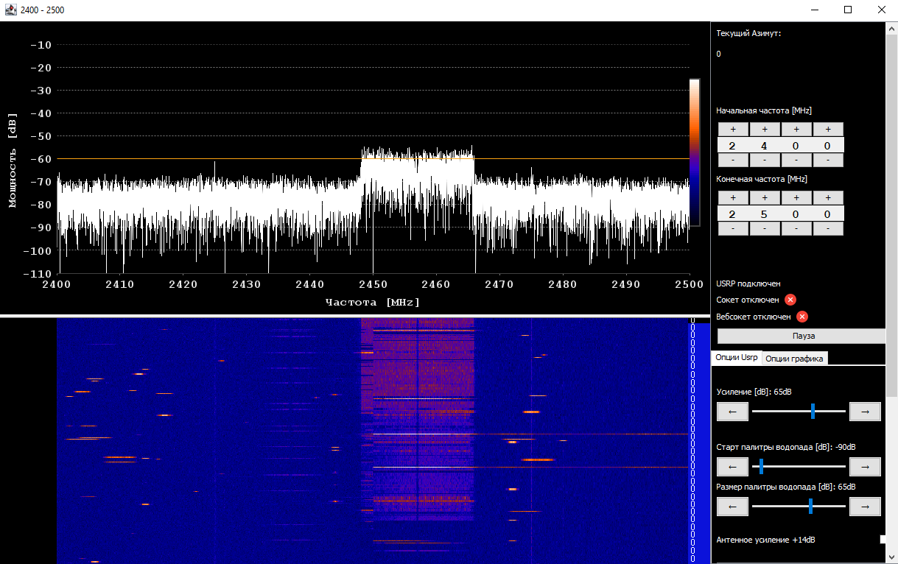

# Spectrum Analyzer GUI for hackrf/USRP sweep for Windows/Linux

### Важно
В [UsrpSweepNativeBridge.java](src-java%2Fusrp%2FUsrpSweepNativeBridge.java) сейчас заходкожен путь до dll, его нужно исправить
### WINDOWS
### Зависимости
#### 1. Maven + jdk 21+
Тут про установку mvn
#### 2. Visual Studio 2022 Build Tools
Visual Studio 2022 Build Tools (или полная VS) → компонент Desktop development with C++
В CLion указываем Toolchain = Visual Studio (MSVC x64)
#### 3. UHD Windows Installer
Переходим [сюда](https://files.ettus.com/binaries/uhd/latest_release/Windows10/), ищем билд, оканчивающися на VS2022, скачиваем, устанавливаем. \
Если пакет установлен по стандартому пути, проверить корректность установки можно через:
```
& "C:\Program Files\UHD\bin\uhd_find_devices.exe"
```
#### 4. vcpkg
vcpkg качаем через
```
git clone https://github.com/microsoft/vcpkg C:\tools\vcpkg
cd C:\tools\vcpkg
.\bootstrap-vcpkg.bat
```
При сборке нужно будет указывать 
```
-DCMAKE_TOOLCHAIN_FILE=C:\dev\vcpkg\scripts\buildsystems\vcpkg.cmake
```
Эту опцию можно вписать в CLion в Settings → Build, Execution, Deployment → CMake → CMake options
#### 5. Boost + fftw3
Также для сборки c++ части нужны зависимости, они устанавливаются через
```
C:\tools\vcpkg install fftw3:x64-windows
C:\tools\vcpkg install boost:x64-windows
```

### СБОРКА
```
<MVN_EXE_PATH> package
```

### Запуск
```
java -jar .\sweep_spectrum_analyzer.jar
```
##### Возможные ошибки
1. **Exception in thread "main" java.lang.Error: Invalid memory access** \
Возникает изза высокой версии сборки libuhd.dll, требующей высокой версии msvcp140.dll (14.4x и выше ), а java может иметь в директории bin библиотеку версии ниже. \
Решение - переименовать файлы рядом с java (добавить .bak): \
msvcp140.dll \
vcruntime140.dll \
vcruntime140_1.dll